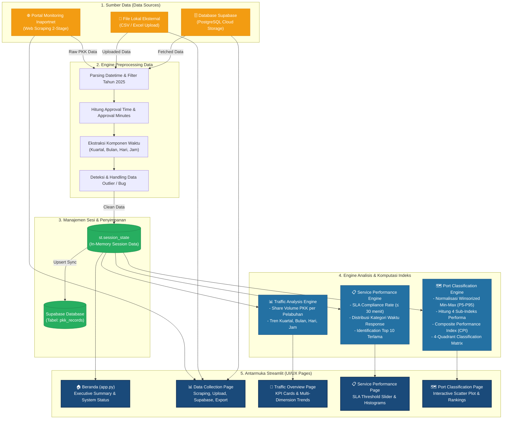
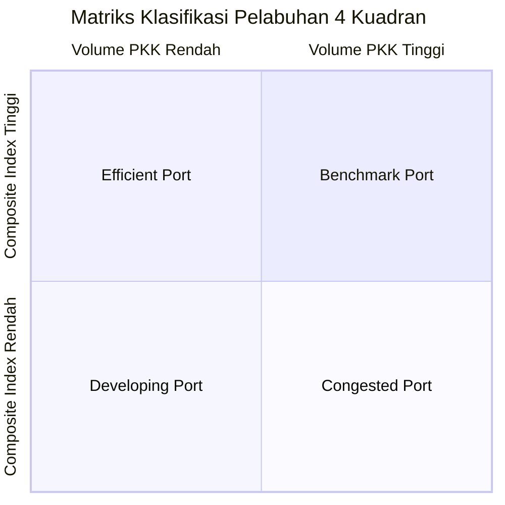

# 🚢 Inaportnet Analytics — Workflow & Arsitektur Aplikasi

Dokumen ini menjelaskan alur kerja (*workflow*), aliran data (*data flow*), arsitektur modul, dan metodologi analisis pada aplikasi **Inaportnet Analytics Dashboard**.

---

## 📐 1. Diagram Alur Kerja Aplikasi (Mermaid Workflow)



---

## 🔄 2. Detail Alur Kerja Per Tahap

### Tahap 1: Pengumpulan & Penginputan Data (*Data Collection*)
Aplikasi mendukung 3 mode penginputan data pada halaman **`1_📊_Data_Collection.py`**:

1. **Web Scraping Direct (Inaportnet Portal)**
   - **Stage 1 (PKK List):** Mengambil daftar PKK berdasarkan kombinasi Kode Pelabuhan $\times$ Jenis Angkutan (`dn`/`ln`) $\times$ Bulan.
   - **Stage 2 (Approval Detail):** Mengambil detail waktu permohonan (*submission*) dan waktu persetujuan (*response*) untuk setiap nomor PKK.
   - Tampilan interaktif dengan *Progress Bar* 2-stage real-time.
2. **Upload File Eksternal**
   - User dapat mengunggah file CSV atau Excel hasil analisis/scraping sebelumnya.
   - Memiliki engine **Validasi Kolom Otomatis** untuk mendeteksi apakah data mentah atau sudah preprocessed.
3. **Load dari Supabase Database**
   - Mengambil data histori dari tabel `pkk_records` di PostgreSQL Cloud Supabase dengan fitur pagination otomatis dan filter pelabuhan.

---

### Tahap 2: Pemrosesan Data (*Preprocessing Engine*)
Modul [`modules/preprocessing.py`](file:///d:/Documents/inaportnetAnalytics/inaportnetDashboard/modules/preprocessing.py) secara otomatis mengeksekusi pipeline berikut:

$$\text{approval\_time} = \text{response\_time} - \text{submission\_time}$$

$$\text{approval\_minutes} = \frac{\text{total\_seconds}(\text{approval\_time})}{60}$$

- **Ekstraksi Komponen Waktu:** Tahun, Kuartal (`Q1`–`Q4`), Bulan (`1`–`12`), Nama Hari (`Monday`–`Sunday`), dan Jam (`00`–`23`).
- **Filtering Scope:** Otomatis membatasi analisis pada scope tahun 2025.
- **Handling Outlier / Data Bug:** Mendeteksi selisih waktu negatif ($\text{approval\_time} < 0$) dan menandainya agar tidak merusak perhitungan statistik.

---

### Tahap 3: Analisis & Komputasi Indeks (*Analytics Engine*)

Modul [`modules/analysis.py`](file:///d:/Documents/inaportnetAnalytics/inaportnetDashboard/modules/analysis.py) menjalankan 3 cabang analisis utama:

#### A. Traffic Analytics
- Menghitung **National Traffic Share (%)** per pelabuhan.
- Mengelompokkan tren transaksi per Kuartal, Bulan, Hari dalam seminggu, dan Jam dalam sehari (dengan *highlight* jam kerja 08:00–17:00).

#### B. Service Performance & SLA Analytics
- Target SLA standar: **$\le 30$ menit** per persetujuan PKK.
- Kategorisasi distribusi waktu respons:
  - `< 30 mnt`, `30-60 mnt`, `1-2 jam`, `2-6 jam`, `6-12 jam`, `12-24 jam`, `> 24 jam`.
- Identifikasi Top 10 pelabuhan dengan waktu approval terlama.

#### C. Port Classification & Composite Index Engine
Setiap pelabuhan diukur menggunakan 4 sub-indeks yang dinormalisasi dengan **Winsorized Min-Max (P5 - P95)**:

1. **Compliance Index ($I_{\text{comp}}$):** % PKK yang memenuhi SLA ($\le 30$ mnt). *(Higher is better)*
2. **Efficiency Index ($I_{\text{eff}}$):** Rata-rata waktu persetujuan. *(Lower is better)*
3. **Consistency Index ($I_{\text{cons}}$):** Koefisien Variasi ($CV = \frac{SD}{\text{Mean}}$). *(Lower is better)*
4. **Robustness Index ($I_{\text{rob}}$):** Proporsi keterlambatan ekstrem ($> 102$ mnt). *(Lower is better)*

**Rumus Composite Performance Index (CPI):**

$$\text{CPI} = \frac{I_{\text{comp}} + I_{\text{eff}} + I_{\text{cons}} + I_{\text{rob}}}{4}$$

**Matrix Klasifikasi 4 Kuadran (Median Threshold):**



| Nama Kuadran | Kriteria Volume | Kriteria Indeks (CPI) | Karakteristik Operasional |
| :--- | :--- | :--- | :--- |
| 🟢 **Benchmark Port** | $\ge \text{Median Volume}$ | $\ge \text{Median CPI}$ | Pelabuhan terbaik: volume tinggi dan performa sangat efisien. |
| 🔵 **Efficient Port** | $< \text{Median Volume}$ | $\ge \text{Median CPI}$ | Pelabuhan efisien dengan beban kerja relatif kecil. |
| 🟠 **Developing Port** | $< \text{Median Volume}$ | $< \text{Median CPI}$ | Perlu pengembangan kapasitas & efisiensi layanan. |
| 🔴 **Congested Port** | $\ge \text{Median Volume}$ | $< \text{Median CPI}$ | Padat transaksi namun terjadi bottleneck persetujuan. |

---

### Tahap 4: Antarmuka & Ekspor (*UI & Export*)
- Visualisasi dibuat secara interaktif menggunakan **Plotly** di modul [`modules/visualization.py`](file:///d:/Documents/inaportnetAnalytics/inaportnetDashboard/modules/visualization.py).
- Pengguna dapat mengekspor data mentah maupun data hasil agregasi/klasifikasi ke format **CSV** dan **Excel (.xlsx)**.

---

## 🛠️ 3. Arsitektur File & Fungsi Modul

```
inaportnetAnalytics/
└── inaportnetDashboard/
    ├── app.py                      # Entry point, status koneksi DB, metric cards
    ├── requirements.txt            # Daftar library Python
    ├── supabase_schema.sql         # SQL DDL untuk pembuatan tabel PostgreSQL
    ├── .streamlit/secrets.toml     # Kredensial SUPABASE_URL & SUPABASE_KEY
    │
    ├── modules/
    │   ├── database.py             # CRUD Supabase (insert_pkk_records, fetch_pkk_records)
    │   ├── scraper.py              # Web Scraper 2-stage (scrape_pkk_list, scrape_approval_times)
    │   ├── preprocessing.py        # Pipeline data cleaning & validasi upload
    │   ├── analysis.py             # Perhitungan statistik, SLA, CPI, & kuadran
    │   └── visualization.py        # Chart Plotly (Donut, Bar, Line, Quadrant Scatter)
    │
    └── pages/
        ├── 1_📊_Data_Collection.py # Scraping, Upload, Supabase, Export
        ├── 2_🚦_Traffic_Overview.py # Visualisasi tren & volume
        ├── 3_📋_Service_Performance.py # SLA threshold & histogram
        └── 4_🗺️_Port_Classification.py # Scatter plot kuadran & ranking
```

---

## 🚀 4. Cara Menjalankan Aplikasi

Buka PowerShell di lokasi project dan jalankan command berikut:

```powershell
# Masuk ke folder dashboard
cd d:\Documents\inaportnetAnalytics\inaportnetDashboard

# Jalankan Streamlit
.\inaportnetdashboard-env\Scripts\python.exe -m streamlit run app.py
```

Aplikasi akan otomatis terbuka di browser pada alamat **`http://localhost:8501`**.
